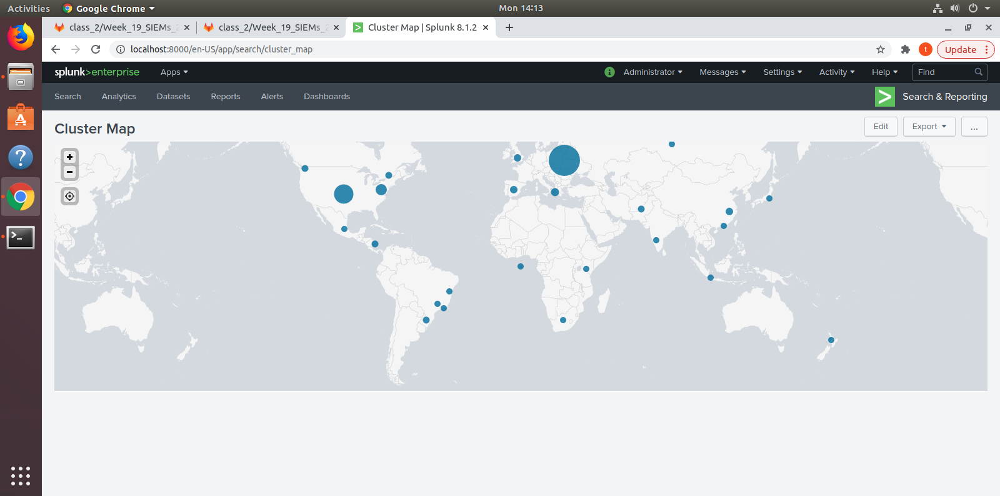
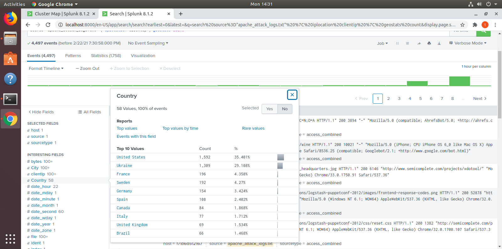
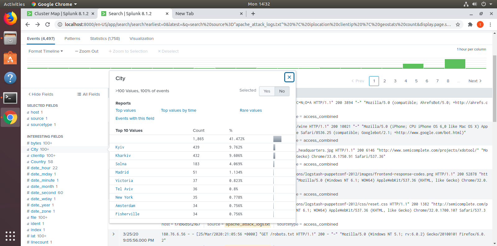

## Unit 19 Homework: Protecting VSI from Future Attacks

### Scenario

In the previous class,  you set up your SOC and monitored attacks from JobeCorp. Now, you will need to design mitigation strategies to protect VSI from future attacks. 

You are tasked with using your findings from the Master of SOC activity to answer questions about mitigation strategies.

### System Requirements 

You will be using the Splunk app located in the Ubuntu VM.

### Logs

Use the same log files you used during the Master of SOC activity:

- [Windows Logs](resources/windows_server_logs.csv)
- [Windows Attack Logs](resources/windows_server_attack_logs.csv)
- [Apache Webserver Logs](resources/apache_logs.txt	)
- [Apache Webserver Attack Logs](resources/apache_attack_logs.txt	)

---

### Part 1: Windows Server Attack

Note: This is a public-facing windows server that VSI employees access.
 
#### Question 1
- Several users were impacted during the attack on March 25th.
- Based on the attack signatures, what mitigations would you recommend to protect each user account? Provide global mitigations that the whole company can use and individual mitigations that are specific to each user.
  
A practical mitigation strategy would include whitelisting IP addresses. IP whitelisting is a security feature often used for limiting and controlling access only to trusted users. IP whitelisting allows you to create lists of trusted IP addresses or IP ranges from which your users can access your domains.
  
#### Question 2
- VSI has insider information that JobeCorp attempted to target users by sending "Bad Logins" to lock out every user.
- What sort of mitigation could you use to protect against this?
  
A mitigation for this could include monitoring access controls so accounts do not have the ability to send "Bad Logins" to every user. Possibly create groups of users if able.

If you have thousands of employees in your organization, as part of the cybersecurity assessment, it becomes important for you to pull out a report on the number of bad logon attempts made by every user in the Active Directory environment. The report would help you learn bad logon attempts made by every user and the “count” is very important here. If you see a few users are sending too many bad logon attempts those users can come under the suspicious category.

### Part 2: Apache Webserver Attack:

#### Question 1
- Based on the geographic map, recommend a firewall rule that the networking team should implement.
- Provide a "plain english" description of the rule.
  - For example: "Block all incoming HTTP traffic where the source IP comes from the city of Los Angeles."
- Provide a screen shot of the geographic map that justifies why you created this rule. 
 
 
 
 
 
  
  
   
 
 If we look at this map, we can see a disproportionate number of attacks coming from Eastern Europe.  After looking into the IP addresses of these attacks we can see they have come from two cities, Kiev and Kharkiv both located in the Ukraine. It is our recommendation to block all incoming HTTP traffic where the source IP comes from the cities of Kiev and Kharkiv.
 
#### Question 2

- VSI has insider information that JobeCorp will launch the same webserver attack but use a different IP each time in order to avoid being stopped by the rule you just created.

- What other rules can you create to protect VSI from attacks against your webserver?
  - Conceive of two more rules in "plain english". 
  - Hint: Look for other fields that indicate the attacker.
  
 Whitelist all IPs within our network
    - Check fields for location, and blacklist any IP coming from that location

### Guidelines for your Submission:
  
In a word document, provide the following:
- Answers for all questions.
- Screenshots where indicated

Submit your findings in BootCampSpot!

---

© 2020 Trilogy Education Services, a 2U, Inc. brand. All Rights Reserved.
